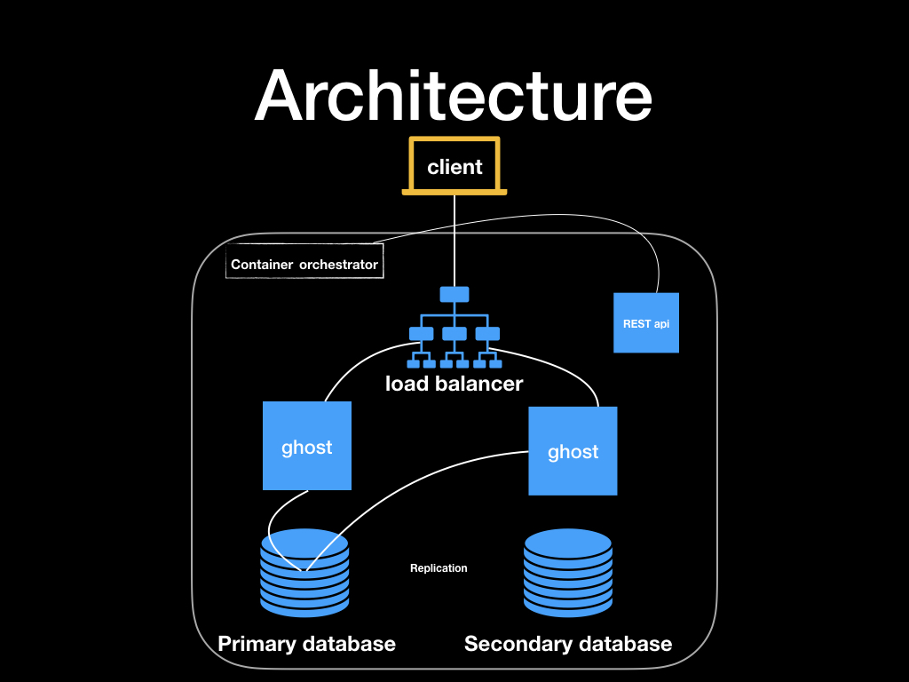

# Systems Operations - Technical Challenge

Hi candidate!! You're about to experience the technical challenge. We recomend you to fork this repo as it could change at any time before you start working on it.

## Premise
Set up a simple 3-tier tech stack, using the following components:
* A load balancer.
* Application server.
* Database server with persistent storage.
* Deployment REST API to update the deployed application.

All tiers must be running as containers, that also implies high availability, and in the case of the database, persistent storage.

The application we want to deploy is [ghost](https://www.npmjs.com/package/ghost). So you'll have to take into account that rolling updates should work with zero downtime.

And finally, a REST API service to deploy the application in a simple way (the technology and framework is up to you!).

Find below the diagram to make an idea of the architecture we want to deploy.

## Requirements
* Be executable, we should be able to run it in a simple way. That means a command/script/tool to spin up the environment and to be able to access the ghost application. We do not expect any content except the default from the ghost application.
* Use containers.
* Use an automation tool (we prefer ansible, but use what you know).
* Extra points for using an orchestrator (docker swarm, kubernetes, apache marathon).
* All your work must be shared using a git repository that we can clone.

## Follow-up
After the challenge has been returned we will go through the returnables and if we are impressed, we will schedule a follow up call where we go through the result and the thought process behind the solution.
